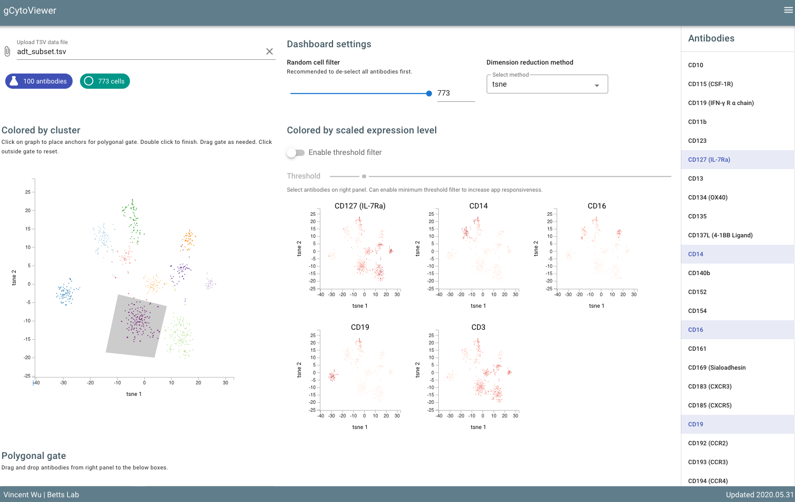

# g-cyto-viewer

Client-side software to visualize datasets generated from CITEseq approaches with antibody derived tags (ADT). Load in a TSV file with tSNE coordinates, cluster information, and scaled antibody expression values to interactively analyze the dataset straight from a browser.

Deployed [here](https://wuv21.github.io/g-cyto-viewer/).



## Current features
- General tSNE cluster scatter plot
- Small multiples of antibody expression
- Single polygonal gating with dual antibody scatter plot
- Random downsampling of cells to improve efficiency as needed

## Getting Started

Steps required to generate TSV file for visualization and analysis

1. Generate ADT dataset (i.e. CITE-seq-count -> Seurat v3 pipeline for ADT analysis)
2. Create a data frame from the seurat object (named `adt_seu` in example code below). Note: your object slot names may be different than ones used below.
    - Note: if you don't have oligo barcode metadata, any unique string identifier will work.
    - TSV settings are completely necessary

    ```r
    library(Seurat)
    library(tidyverse)
    
    # get scaled expression values and barcode column
    df_scaled_data <- data.frame(t(adt_seu@assays$adt@scale.data)) %>%
        mutate(barcode = rownames(.))

    # get dim reduction coordinates along with barcode and cluster identity
    tsne_coords <- adt_seu@reductions$tsne_adt_postCD45@cell.embeddings
    umap_coords <- adt_seu@reductions$umap@cell.embeddings

    df_final <- data.frame(
        barcode = rownames(tsne_coords),
        cluster = adt_seu$snn_postCD45_res.1.5,
        xaxis_tsne = tsne_coords[, 1],
        yaxis_tsne = tsne_coords[, 2],
        xaxis_umap = umap_coords[, 1],
        yaxis_umap = umap_coords[, 2]
    )

    # merge dataframes and save as TSV (tsv setttings are necessary!)
    df_save <- df_scaled_data %>%
        left_join(df_final, by = "barcode") %>%
        write.table("adt_subset.tsv",
            quote = FALSE,
            col.names = TRUE,
            row.names = FALSE, sep = "\t")
    ````

    The resultant TSV file will look somewhat like this:

    barcode | xaxis_tsne | yaxis_tsne | xaxis_umap | yaxis_umap | cluster | CD3 | CD4 | CD5 | CD8 | more_markers
    --- | --- | --- | --- | --- | --- | --- | --- | --- | --- | --- | --- 
    TCGATGA | 3.214 | 3.4125 | -7.4 | 1.5 | 1 | -0.5 | 0.5 | 0.4 | 0.6 | etc...
    more cells... | | | | | | | | | 

    The following columns must exist.
    - barcode
    - tSNE_1
    - tSNE_2
    - cluster

    All other columns must be expression data (i.e. must contain numerical values).

3. Load up website and load in TSV dataset.
4. Visualize and analyze to your heart's content!

## For developers
To build upon this tool or to run a local instance:
1. Clone github repo
2. `cd` into repo
3. Install npm pacakges: `npm install`
4. Set up local host server: `npm run serve`
5. Navigate to `localhost:8080` on your browser (the port may differ by user's settings)

## Built With

* [Vue](https://vuejs.org/) - Web framework used
* [Vuetify](https://vuetifyjs.com/en/) - UI framework used with Vue
* [D3](https://d3js.org/) - Comprehesnvie data visualization package
* [D3 polybrush](https://gist.github.com/gtb104/3667340) and [D3 polybrush updated](http://bl.ocks.org/junwang23/bfcf242c09f0aaa0d6a27cdc84285a8e) - Polybrush for gating

## Acknowledgments

* Much thanks to [Mike Freeman](https://info474-s17.github.io/book/d3-reusability.html) for his tutorials regarding reusable charts and his template for a scatterplot chart.
